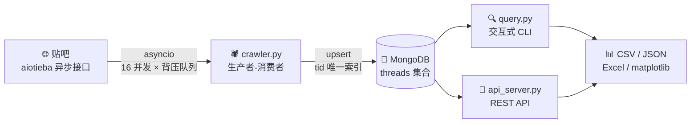

<div align="center">

# 🕷️ 贴吧爬虫 · MongoDB 数据管道

**一个能上生产结构的贴吧数据采集项目 —— 异步爬虫 + 幂等入库 + 查询 CLI + REST API，全部加起来 1500+ 行代码。**

[](https://www.python.org/)
[](https://www.mongodb.com/)
[](https://pymongo.readthedocs.io/)
[](LICENSE)
[](#-测试)
[](#-技术栈)

[功能特性](#-功能特性) · [快速开始](#-快速开始) · [架构设计](#-架构) · [踩坑实录](#-踩坑实录最值得看的部分) · [学习手册](docs/学习手册.md)

</div>

---

## 📖 这是什么

一个把**爬虫工程化**的完整示例。它做四件事：



**它不是"能跑就行"的爬虫。** 项目里的每个设计决策都来自一次真实的线上故障 —— 包括那个让爬虫在特定贴吧**必然崩溃**的 `yarl.URL` 序列化 bug（[见踩坑实录](#-踩坑实录最值得看的部分)）。

### 为什么值得一看

| 你可能踩过的坑 | 本项目的做法 |
|---|---|
| 爬 10 次产生 10 份重复数据 | `tid` 唯一索引 + `upsert`，**天然幂等**，爬多少次都是同一份 |
| 一条脏数据让整页写入失败 | BSON 类型递归清洗 + 单条容错，**坏数据只丢自己** |
| 并发任务无限堆积把内存撑爆 | `asyncio.Queue(maxsize=N)` **背压**，缓冲区满则生产者阻塞 |
| 异步驱动 `aggregate()` 忘了 `await` | 见[架构](#-架构)，两者 API 不一致，项目里有明确注释 |
| 爬虫崩了不知道崩在哪一条 | 结构化日志 + 跳过多计，每页入库结果都有统计 |
| 装个查询工具还得下 mongosh | 自带 `query.py`，**零依赖**，还支持中文吧名和柱状图 |

---

## ✨ 功能特性

- **🚀 高并发异步爬取** —— 生产者-消费者模型，16 个协程并发，队列背压防雪崩，单页失败不影响整体
- **🛡️ 幂等入库** —— `UpdateOne + upsert` 而非 `insert_many`，重复爬取只更新不重复，浏览量等变化字段自动刷新
- **🧹 自动 BSON 类型清洗** —— 递归把 `yarl.URL` / `NaN` / `Infinity` 等 bson 不认的类型转成安全值，**不会再因为一条带链接的帖子崩掉整个爬虫**
- **⚡ 6 个针对性索引** —— 按吧+浏览量/回复数/时间、全局时间、标题全文，`explain` 一键确认是否走索引
- **🔍 交互式查询 CLI** —— 12 个命令，像 mongosh 但**直接支持中文吧名**，内置 Top 榜、热帖回复率、按天柱状图、CSV/JSON 导出
- **🔌 零依赖 REST API** —— 标准库 `http.server` 实现，8 个接口，含**排序字段白名单**防慢查询注入
- **🧪 58 项检查** —— 25 项真实端到端 + 15 项接口层 + 18 项离线输出，全部可独立运行
- **🔐 凭据零硬编码** —— BDUSS 从 `.env` / 环境变量读取，仓库里没有任何密钥

---

## 🚀 快速开始

### 前置条件

- Python **3.10+**（用到了 `X | None` 语法）
- MongoDB **6.0+**（本地或远程都行）

### 1. 获取代码

```bash
git clone https://github.com/258tom/tieba-crawler-mongodb.git
cd tieba-crawler-mongodb
```

### 2. 装依赖

```bash
python -m venv .venv

# Windows
.\.venv\Scripts\python.exe -m pip install -r requirements.txt
# macOS / Linux
./.venv/bin/python -m pip install -r requirements.txt
```

只有 **2 个运行时依赖**：`aiotieba`（贴吧客户端）和 `pymongo`（数据库驱动）。

### 3. 启动 MongoDB

```bash
# 方式一：本机已安装 MongoDB
mongod --dbpath /your/data/path

# 方式二：Docker（最省事）
docker run -d -p 27017:27017 --name mongo mongo:8.0
```

验证一下通了：

```bash
python -c "from pymongo import MongoClient; print(MongoClient('mongodb://127.0.0.1:27017', serverSelectionTimeoutMS=3000).admin.command('ping'))"
```

### 4. 配置凭据（必需）

```bash
# Windows
copy .env.example .env
# macOS / Linux
cp .env.example .env
```

编辑 `.env`，填上你的 BDUSS：

```ini
TIEBA_BDUSS=你的一长串BDUSS
```

<details>
<summary><b>BDUSS 怎么获取？（点开）</b></summary>

1. 浏览器打开 <https://tieba.baidu.com> 并确保**已登录**
2. 按 `F12` → **Application / 应用程序** → **Cookies** → `https://tieba.baidu.com`
3. 找到名为 `BDUSS` 的那一行，复制它的完整 **Value**（很长，几百字符）
4. 只复制 Value，**不要**带 `BDUSS=` 前缀

> ⚠️ **BDUSS 等同于你的账号凭据** —— 泄露后别人可以用你的号发帖、删帖。
> `.env` 已在 `.gitignore` 中，**永远不要**把真实 BDUSS 写进 `.py` 文件或提交到仓库。

</details>

### 5. 跑起来

```bash
# 先不联网验证一遍链路（不需要 BDUSS，用假数据跑通入库全流程）
python crawler.py --offline

# 真实爬取
python crawler.py --fname 弱智 --max-page 32 --workers 8

# 查询数据（不带参数 = 交互模式）
python query.py
```

<details>
<summary><b>没有 MongoDB 也想先看看效果？</b></summary>

不用数据库也能体验查询工具和爬虫逻辑：

```bash
# 看 asyncio 串行 vs 并发的耗时差异
python demo_asyncio_basic.py

# 看生产者-消费者 + 队列背压的三种写法（含一个反面教材）
python demo_asyncio_queue.py
```

</details>

---

## 🏗️ 架构

### 数据流

**爬取**（`crawler.py`）—— 生产者-消费者 + 背压：

```python
task_queue = asyncio.Queue(maxsize=worker_num)   # maxsize = 背压阈值

async def producer():
    for pn in range(1, max_page + 1):
        await task_queue.put(pn)                 # 队列满 -> 这里被阻塞，天然限流
    nonlocal is_running
    is_running = False                           # ⚠️ 必须在 for 循环外

async def worker(i):
    while True:
        try:
            pn = await asyncio.wait_for(task_queue.get(), timeout=1)
        except TimeoutError:
            if not is_running:                   # 区分"暂时没任务"和"活干完了"
                return
            continue
        threads = await client.get_threads(fname, pn)
        await store.save_threads(threads)        # 抢到一页就立刻入库

await asyncio.gather(*[worker(i) for i in range(worker_num)], producer())
```

**入库**（`mongo_store.py`）—— 幂等的核心就三行：

```python
UpdateOne(
    {"tid": tid},                                        # 用 tid 当唯一键
    {"$set": doc,                                        # 变化字段（浏览量等）刷新
     "$setOnInsert": {"first_crawled_at": now}},         # 首次时间只在插入时写
    upsert=True,                                         # 有则更新，无则插入
)
```

### 数据模型

MongoDB **没有 JOIN**，所以作者信息直接嵌进帖子文档：

```jsonc
{
  "_id": ObjectId("..."),
  "tid": 900006029,                 // 主题帖 id —— 唯一索引，去重基石
  "fname": "弱智",                   // 吧名
  "title": "测试标题：房价会跌吗",
  "view_num": 28770,                // 浏览量（每次爬取会刷新）
  "reply_num": 210,
  "is_good": false,                 // 精品帖标记
  "create_time": 1767761400,        // 10 位秒级时间戳（排序用）
  "create_dt": ISODate("2026-01-07T04:50:00Z"),   // 额外存的 Date 类型，供聚合按天分组
  "posted_at_text": "2026-01-07 12:50:00",        // 额外存的可读时间
  "crawled_at": ISODate("2026-09-12T07:12:55Z"),  // 本次爬取时间
  "first_crawled_at": ISODate("2026-09-12T07:12:55Z"), // 首次爬取时间（更新不覆盖）
  "source": "get_threads/pn=6",     // 数据来自哪一页
  "user": {                         // 作者信息，嵌套（没有 JOIN）
    "user_id": 100029,
    "user_name": "离线用户29",
    "level": 14
  },
  "contents": {                     // 正文结构化碎片
    "texts": [{ "text": "正文第一段" }],
    "imgs": [{ "src": "...", "hash": "..." }],
    "links": []
  }
}
```

### 索引设计

| 索引名 | 字段 | 服务的查询 |
|---|---|---|
| `uniq_tid` | `tid` **唯一** | 去重基石 —— 保证一个帖子只有一条文档 |
| `fname_view` | `fname` ↑ + `view_num` ↓ | 「某吧浏览量排行」← **最常用** |
| `fname_create` | `fname` ↑ + `create_time` ↓ | 「某吧最新帖子」 |
| `fname_reply` | `fname` ↑ + `reply_num` ↓ | 「某吧回复数排行」 |
| `create_time` | `create_time` ↓ | 不限吧的全局时间排序 |
| `title_text` | `title` 全文索引 | 标题全文搜索 |

> **最左前缀原则**：`fname + view_num` 能服务"先按吧筛选、再按浏览量排序"。
> 反过来建 `view_num + fname` 就用不上了 —— 和 MySQL 的联合索引一个道理。

### 项目结构

```
.
├── crawler.py               # 🕷️ 爬虫主体：异步并发 + 边爬边入库
├── mongo_store.py           # 🍃 存储层：连接、索引、类型清洗、upsert、查询封装
├── query.py                 # 🔍 查询 CLI：交互模式 + 命令行模式 + 导出
├── api_server.py            # 🔌 REST API：标准库实现，零第三方依赖
├── tieba_env.py             # 🔐 配置加载：把 .env 读成环境变量（标准库解析）
│
├── demo_asyncio_basic.py    # 📚 教学：async/await/gather，串行 vs 并发实测
├── demo_asyncio_queue.py    # 📚 教学：生产者-消费者 + 背压（含反面教材）
│
├── test_e2e_mongodb.py      # 🧪 真实端到端（25 项检查，需 MongoDB）
├── test_api_server.py       # 🧪 接口层（15 项检查，假集合，离线）
├── test_mongo_store.py      # 🧪 存储层（输出 18 项检查结果，离线）
│
├── docs/学习手册.md          # 📘 从零学起的完整路线图（6 阶段）
├── .env.example             # 配置模板
├── requirements.txt         # 运行时依赖（只有 2 个）
└── requirements-dev.txt     # 开发依赖（pytest / ruff）
```

---

## 🧪 测试

**58 项检查**，分三层，都可以独立运行：

```bash
# ① 存储层：不需要数据库（文档转换、BSON 编码、错误信息）
python test_mongo_store.py

# ② 接口层：不需要数据库（路由、分页、参数校验、中文 JSON 编码）
python test_api_server.py

# ③ 真实端到端：需要 MongoDB 在跑（幂等性、字段类型、索引命中）
python test_e2e_mongodb.py
```

端到端测试会自己创建 `端到端验证吧` 并**结束后自动清理**，不会污染你的真实数据。

<details>
<summary><b>端到端测试都验证了什么？（点开）</b></summary>

```
PASS  建索引   ['uniq_tid', 'fname_create', 'fname_view', 'fname_reply', 'create_time', 'title_text']
PASS  uniq_tid 是唯一索引
PASS  首次入库 10 条   {'inserted': 10, 'updated': 0, 'skipped': 0, 'total': 10}
PASS  重复写同一批：新增 0 条   {'inserted': 0, 'updated': 10, 'skipped': 0, 'total': 10}
PASS  重复写后仍是 10 条（没产生重复）
PASS  浏览量被更新   1111 -> 999999
PASS  first_crawled_at 没被覆盖
PASS  type 以整数存储（IntEnum）   1
PASS  create_dt 是 Date 类型   datetime
PASS  user 是嵌套文档   验证用户
PASS  排序查询走了索引（IXSCAN）而非全表扫描
PASS  清理掉本次测试数据   删除 10 条
```

</details>

---

## 🔍 查询工具

### 交互模式（推荐日常使用）

```bash
python query.py
```

进去之后像 mongosh 一样，**直接输入吧名就能切换**：

```
  ===== 贴吧数据查询（交互模式）=====
  共有 1,044 条数据，来自 2 个吧：中国人口, 弱智

  [中国人口] > 弱智                          ← 切到"弱智"吧
  [弱智] > top 5                             ← 浏览量 Top5
  [弱智] > daily 14                          ← 最近 14 天发帖量（终端柱状图）
  [弱智] > find {"view_num":{"$gt":1000000}} ← 原生 MongoDB 查询
  [弱智] > all                               ← 不限吧
  [弱智] > exit
```

<details>
<summary><b>完整命令列表（12 个，点开）</b></summary>

| 命令 | 作用 |
|---|---|
| 直接输入吧名 | 切换当前吧（如 `弱智`）；`all` 表示不限 |
| `stats` | 总览：每个吧多少帖、总浏览量 |
| `top 10` | 浏览量 Top10 |
| `latest 10` | 最新发帖 |
| `hot 10` | 回复率最高的热帖（聚合管道计算） |
| `recent 7` | 最近 7 天发布的帖子 |
| `search 房价` | 标题含关键词 |
| `author 某网友` | 某作者的帖子（嵌套字段查询） |
| `daily 14` | 最近 14 天发帖量 + 终端柱状图 |
| `find {...}` | **原生 MongoDB 查询**（学语法最有用） |
| `show 900006029` | 看某条帖子的**完整文档**（学数据结构最有用） |
| `indexes` / `explain {...}` | 查看索引 / 查询计划 |

</details>

### 命令行模式（适合写脚本、导出）

```bash
python query.py top 10                                   # 浏览量 Top10
python query.py top 100 --min-views 100000               # 加过滤条件
python query.py top 50 --export top50.csv                # 导出给 Excel
python query.py search 房价 --limit 5
python query.py top 1 --fname 弱智 --raw                 # 打印原始文档结构
python query.py stats
```

导出 CSV 使用 **UTF-8 with BOM**，Excel 双击打开中文不乱码。

### 实际输出长这样

```
  【view_num 排行】弱智  Top3
    #        浏览      回复     点赞  发帖时间             作者           标题
  --- --------- ------- ------ ---------------- ------------ ----------------------------------
    1    28,770     210     90  2026-01-07 12:50:00 离线用户29       [离线] 弱智 第 6 页第 29 帖
    2    27,811     203     87  2026-01-07 12:40:00 离线用户28       [离线] 弱智 第 6 页第 28 帖
    3    26,852     196     84  2026-01-07 12:30:00 离线用户27       [离线] 弱智 第 6 页第 27 帖
```

---

## 🔌 REST API

零第三方依赖（标准库 `http.server`），启动即用：

```bash
python api_server.py --port 8000
```

| 方法 | 路径 | 说明 |
|---|---|---|
| `GET` | `/` | 接口说明 |
| `GET` | `/api/health` | 健康检查（MongoDB 连接状态 + 版本） |
| `GET` | `/api/stats` | 汇总统计：每个吧的帖子数、总浏览量 |
| `GET` | `/api/forums` | 有哪些吧的数据 |
| `GET` | `/api/threads` | 分页查询（`fname` `sort` `order` `page` `size`） |
| `GET` | `/api/threads/{tid}` | 单条帖子详情（含正文全文） |
| `GET` | `/api/top` | 排行榜（`by=views\|replies\|agree`） |
| `GET` | `/api/search` | 标题关键词搜索 |
| `POST` | `/api/crawl` | 触发一次爬取（后台线程，立即返回 202） |

```bash
curl "http://127.0.0.1:8000/api/top?fname=弱智&by=views&limit=5"
curl "http://127.0.0.1:8000/api/search?q=房价&limit=3"
curl -X POST http://127.0.0.1:8000/api/crawl \
     -H "Content-Type: application/json" \
     -d '{"fname":"弱智","max_page":32}'
```

**安全设计**：`sort` 参数走**白名单**，非法字段直接 400 —— 防止构造慢查询打垮数据库。

```bash
$ curl "http://127.0.0.1:8000/api/threads?sort=;drop"
{"ok": false, "error": "sort 只支持 ['agree', 'create_time', ... ]，收到 ';drop'"}
```

> ⚠️ 服务默认只监听 `127.0.0.1`（仅本机可访问）。**不要**随便改成 `0.0.0.0`，
> 那等于把整个数据接口暴露到局域网，而 API 目前没有任何鉴权。

---

## 💥 踩坑实录（最值得看的部分）

### Bug 1：正文带链接的帖子会让爬虫必然崩溃

**现象** —— 爬「弱智」「中国人口」一切正常，换成「营山二中」直接崩：

```
bson.errors.InvalidDocument: cannot encode object:
URL('http://tieba.baidu.com/mo/q/checkurl?url=...'), of type: <class 'yarl.URL'>
```

**根因** —— 帖子正文里带链接时，aiotieba 会把链接解析成 `yarl.URL` **对象**而不是字符串。
`dataclasses.asdict()` 忠实地把这个对象转进了字典，但 bson 只支持有限的基础类型。

**为什么致命** —— `save_threads` 是**一页 30 条一起提交**的。其中**任何一条**编码失败，
整页的 `bulk_write` 就全部失败、异常冒泡、整个爬虫挂掉。也就是 **30 条里只要有 1 条带链接，这一页全丢**。

**实测数据** —— 这也解释了为什么同样的代码在不同吧上表现完全不同：

| 吧 | 帖子数 | 带链接的帖子 | 结果 |
|---|---|---|---|
| 弱智 | 89 | 0 | ✅ 正常 |
| 中国人口 | 955 | 0 | ✅ 正常 |
| 营山二中 | 849 | **9** | 💥 **崩溃** |

**修复** —— 在序列化边界做一次递归清洗，遇到 bson 不认的类型**统一转成字符串**
（而不是专门处理 `yarl.URL`）—— 这样以后 aiotieba 升级引入新的第三方类型也不会再崩：

```python
def _sanitize(obj, ...):
    if isinstance(obj, _BSON_SCALARS) or obj is None:
        return obj                                    # bson 认得的，留着
    if isinstance(obj, float) and (obj != obj or obj in (inf, -inf)):
        return None                                   # NaN / Infinity 存不了
    if isinstance(obj, (dict, list, tuple)):
        return ...                                    # 递归
    return str(obj)                                   # 其它一切 -> 字符串
```

再加上单条容错：单条编码失败只记 `warning` 并跳过**这一条**，不再让整页失败。

> **教训**：`dataclasses.asdict()` 转出来的字典**不等于**可以直接存进数据库的文档。
> 任何跨"序列化边界"的地方（写 JSON、写 SQL 同理）都需要一次类型清洗。

### Bug 2：异步驱动的 `aggregate()` 和 `find()` 用法不一样

同一个库里两个方法的 API 不一致 —— 这是 pymongo 异步版的设计：

```python
# find() —— 直接返回游标，不用 await
cursor = collection.find({...})
async for doc in cursor: ...

# aggregate() —— 返回的是协程，必须先 await！
cursor = await collection.aggregate(pipeline)   # 漏掉 await 就报：
async for doc in cursor: ...                    # TypeError: 'async for' requires an object
                                                # with __aiter__ method, got coroutine
```

### Bug 3：`$project` 是白名单，新算的字段要显式加进去

```python
pipeline = [
    {"$addFields": {"reply_rate": {"$divide": ["$reply_num", {"$max": ["$view_num", 1]}]}}},
    {"$project": {**BRIEF, "reply_rate": 1}},   # ⚠️ 不写这一行，reply_rate 会被静默过滤掉
]
```

`$project` 只保留列出的字段。`reply_rate` 是 `$addFields` 新加的，所以它也得列进去，
否则算完了却取不到 —— 表现是「热帖」功能显示不出回复率，**不报错，只是安静地没有**。

### Bug 4：驱动选型 —— 别用 motor

`motor` 这个异步驱动**已被官方废弃**。官方推荐直接用 pymongo 自带的异步客户端
（pymongo **4.9+** 提供 `pymongo.asynchronous`）：

```python
from pymongo import AsyncMongoClient      # 异步（爬虫用）
from pymongo import MongoClient           # 同步（API 用）
```

### 其他坑（简表）

| 报错 / 现象 | 原因 | 解决 |
|---|---|---|
| `DuplicateKeyError: E11000` | 撞了 `uniq_tid` 唯一索引 | 用 `upsert`，别用 `insert_many` |
| `DocumentTooLarge` | 单条文档超过 16 MB | 入库前检查体积并跳过（已内置） |
| `ServerSelectionTimeoutError` | MongoDB 没启动 | 先起数据库；连接超时已调到 5 秒，让错误快速暴露 |
| `TypeError: no binding for nonlocal` | `nonlocal` 缩进进了 for 循环 | 必须写在函数体第一层 |
| 聚合按天统计不准 | 只有时间戳没法 `$dateToString` | 额外存一个 `create_dt`（Date 类型）字段 |
| 中文 JSON 变成 `\uXXXX` | `json.dumps` 默认转义 | `ensure_ascii=False` + UTF-8 响应头 |

---

## 🧰 技术栈

| 层次 | 选型 | 为什么 |
|---|---|---|
| 爬取 | [`aiotieba`](https://github.com/Starry-OvO/aiotieba) | 贴吧异步客户端，返回结构化的 dataclass |
| 并发 | `asyncio` | 网络 IO 密集，协程比线程轻量得多 |
| 存储 | MongoDB 8.0 | 文档模型天然贴合「结构不固定的帖子」；无需建表 |
| 驱动 | `pymongo` 4.9+ | 官方异步客户端（`AsyncMongoClient`） |
| API | 标准库 `http.server` | 零依赖，`ThreadingHTTPServer` 够用 |
| 配置 | 标准库 + `.env` | 不引入 `python-dotenv`，30 行搞定 |

**为什么不用 FastAPI？** 这个项目的重点是爬虫和数据建模，不是 Web 框架。
`http.server` 让"拿到就能跑"成立。想上生产的话，把 `ROUTES` 和 `api_*` 函数搬到 FastAPI 只需换一层壳。

---

## 📘 想系统学习？

代码里的注释是**教学式**的 —— 每个设计决策都写了"为什么这么做"和"不这么做会怎样"。

完整的学习路线图在 **[docs/学习手册.md](docs/学习手册.md)**，按依赖顺序分 6 个阶段，
每个阶段都有明确目标和验证方法：

| 阶段 | 主题 | 你会搞清楚 |
|---|---|---|
| 0 | 环境 | 虚拟环境、进程 vs 服务 |
| 1 | 数据结构 | aiotieba 返回的对象长什么样 |
| 2 | 异步编程 | 协程、事件循环、`gather`、队列背压 |
| 3 | MongoDB 基础 | 集合/文档/索引，不用建表怎么存 |
| 4 | **数据建模** | 为什么用 `tid` + upsert 而不是 `insert_many` |
| 5 | HTTP 接口 | 同步 vs 异步客户端、白名单校验 |
| 6 | 可视化 | 从 CSV 到 matplotlib / Streamlit 仪表板 |

> 💡 **建议学法**：不要从头到尾读代码。先按阶段跑通、观察现象，再回头读那一块代码。

---

## ❓ FAQ

<details>
<summary><b>BDUSS 多久会失效？失效了怎么办？</b></summary>

BDUSS 有效期通常较长，但**重新登录、改密码、异地登录**都可能让它失效。
失效后的表现是爬取时抛出登录相关异常。重新按[步骤 4](#4-配置凭据必需)提取一次即可。

</details>

<details>
<summary><b>爬太快会不会被封？</b></summary>

项目通过队列背压限制了并发上限，但**没有内置速率限制**。建议：
`--workers` 不要超过 8~16，`--max-page` 不要一次拉太多，两次爬取之间留间隔。
生产环境建议加 `asyncio.Semaphore` 或令牌桶做主动限流。

</details>

<details>
<summary><b>为什么不用 mongosh 查询？</b></summary>

`query.py` 是**有意替代 mongosh** 的：直接支持中文吧名（mongosh 里要手写 UTF-8 编码的查询）、
自带格式化表格输出、柱状图、CSV 导出，还有 `hot` 这种现成的业务聚合。
当然，`find {...}` 命令支持完整的原生查询语法，学 MongoDB 语法完全够用。

</details>

<details>
<summary><b>Windows 控制台中文乱码怎么办？</b></summary>

在 PowerShell 里执行一次（只影响当前窗口）：

```powershell
$env:PYTHONIOENCODING = "utf-8"
[Console]::OutputEncoding = [System.Text.Encoding]::UTF8
```

或者用 Windows Terminal（默认就是 UTF-8）。

</details>

<details>
<summary><b>数据量大了怎么办？</b></summary>

几个方向：
- **分页用游标而不是 `skip`** —— `skip` 会真的数过去，数据量大时极慢。改用"记住上一页最后一个 `view_num`，下一页查 `$lt`"
- **加覆盖索引** 让常用查询完全走索引，不回表
- **`$text` 全文检索** 替代 `$regex`（正则无法走索引）
- **按时间分集合/归档** 老数据迁到历史集合

</details>

---

## ⚠️ 免责声明

本项目**仅供学习与技术研究使用**。

- 请遵守[百度贴吧用户协议](https://tieba.baidu.com/tb/eula.html)及目标站点的 `robots.txt`
- 请勿高频请求，避免对目标服务器造成压力
- 请勿将采集到的数据用于商业用途或侵犯他人隐私
- 由使用本项目产生的一切后果由使用者自行承担

---

## 🤝 贡献

欢迎 Issue 和 PR！特别是：

- 新的查询命令或可视化方向
- 速率限制 / 代理池等反爬对抗增强
- 把 REST API 迁移到 FastAPI 的版本
- 文档改进和错别字修正

## 📄 License

[MIT](LICENSE) © 2026 258tom

---

<div align="center">

**如果这个项目帮你搞懂了异步爬虫或 MongoDB 建模，点个 ⭐ Star 是最实在的鼓励**

</div>
